# Практическая работа №1
## Основы командной строки Linux

### 1. Создание ВМ

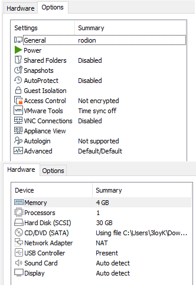
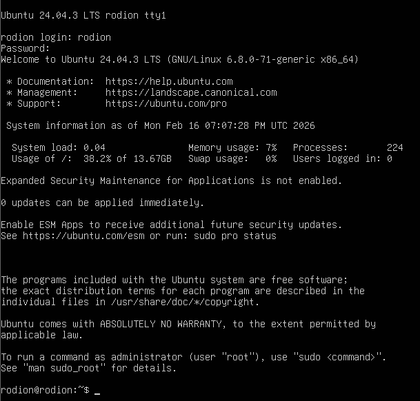

### 2. Информация о системе

### 3. Сеть: IP-адрес и открытые порты

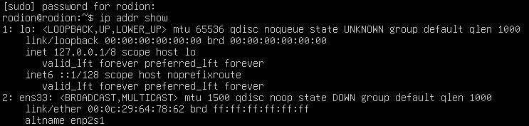
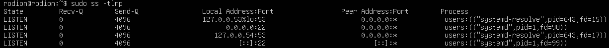

### 4. Сервис SSH

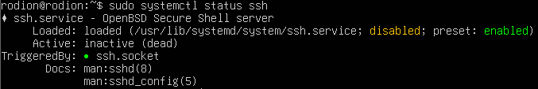
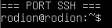

### 5. Пользователи и группы

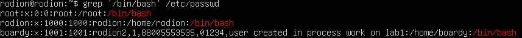
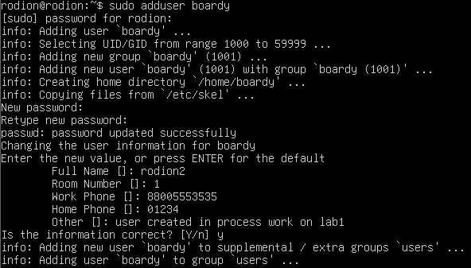
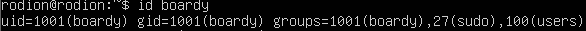

### 6. Дерево каталогов

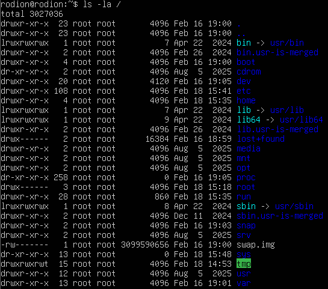
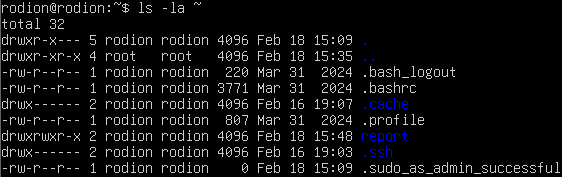

### 7. Права доступа

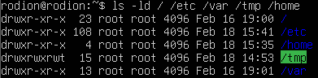
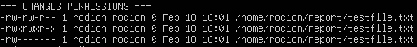

### 8. Установленные пакеты и сервисы

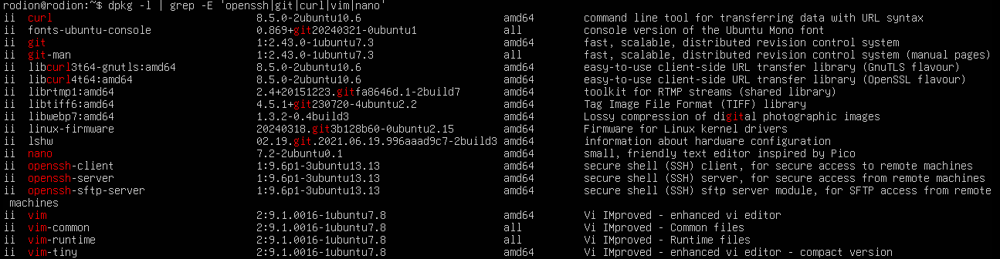
На скриншоте без python, потому что слишком много библиотек скачано

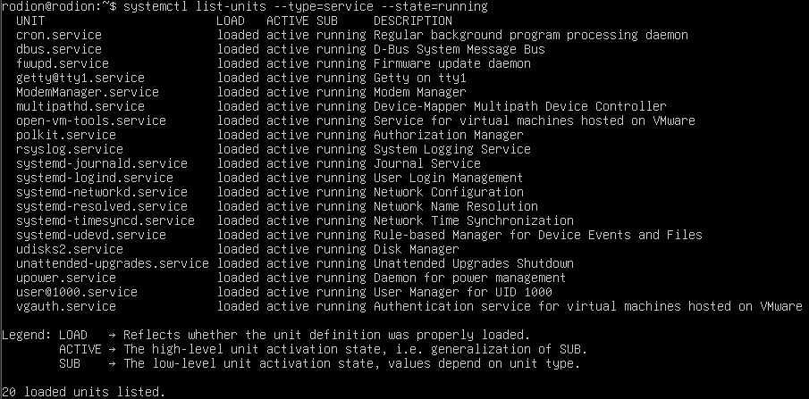

### 9. Конвейер и перенаправление

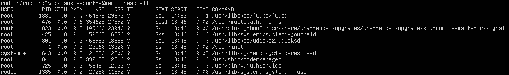

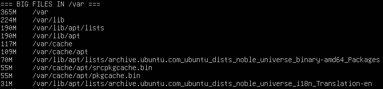

### 10. Итоговый файл

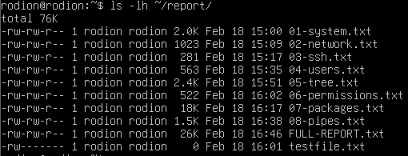
