# Практика 12
## Laravel: переезд на фреймворк (MVC + Breeze + Socialite)

### Часть A. Установка и переключение домена
### 1. Composer и PHP-расширения

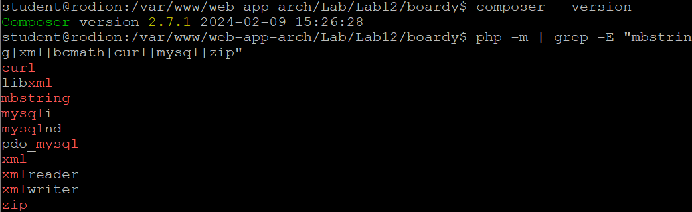

### 2. Переезд папок

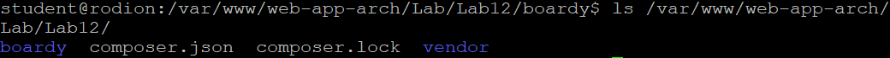
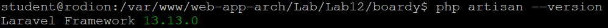

### 3. Структура Laravel

Если указать nginx на корень `/var/www/boardy/`, то наружу станут доступны:
- `.env` — секреты (пароли БД, GITHUB_CLIENT_SECRET)
- `vendor/` — исходники всех Composer-пакетов
- `storage/logs/` — логи приложения
- `app/` — исходный код контроллеров и моделей

Это критическая уязвимость. `public/` — единственная «белая» папка, всё остальное закрыто.

### 4. Nginx-конфиг

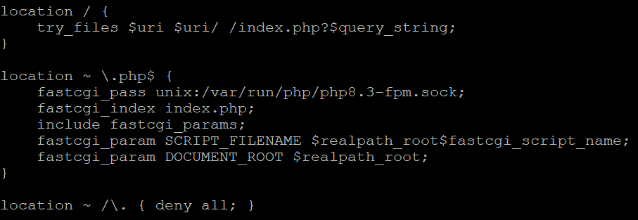
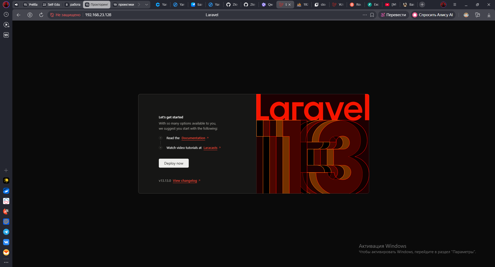

### Часть B. БД, миграции, сидер

### 5. Создание БД library_main

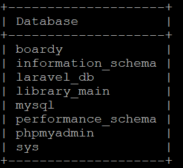

### 6. Подключение Laravel к БД

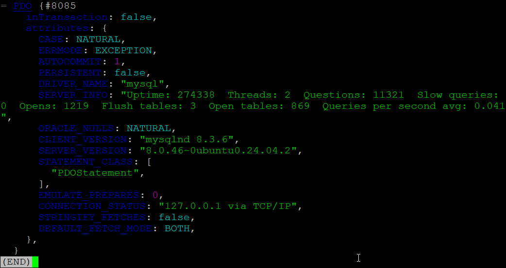

### 7. Миграции posts и comments

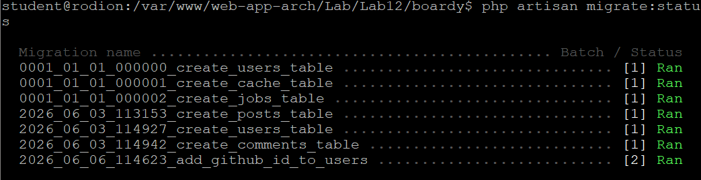
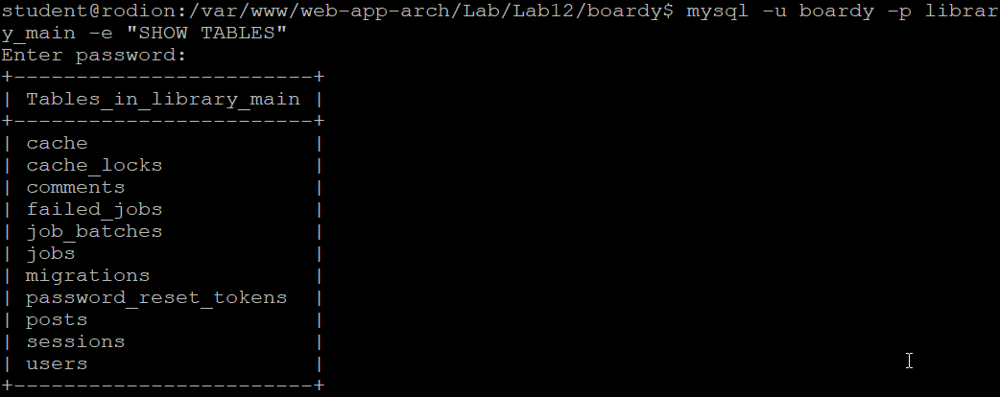

### 8. Модели со связями

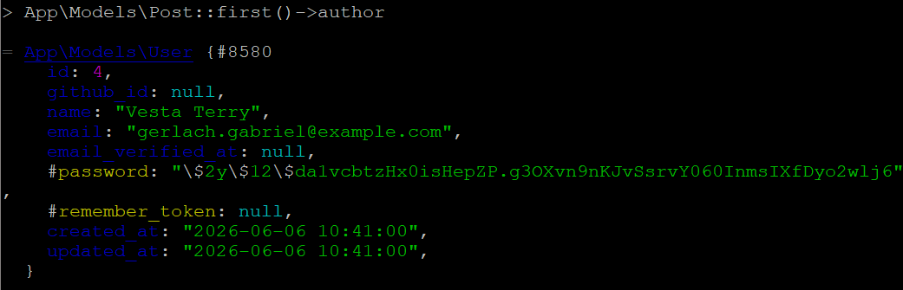

### 9. Сидер

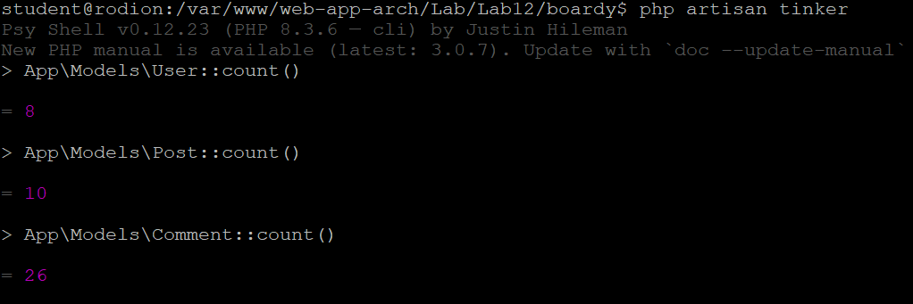

### Часть C. CRUD постов и комментариев

### 10. Маршруты

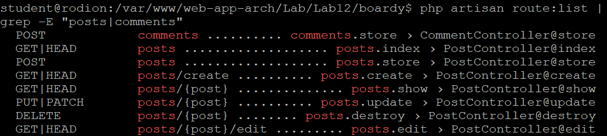

### 11. Лента постов

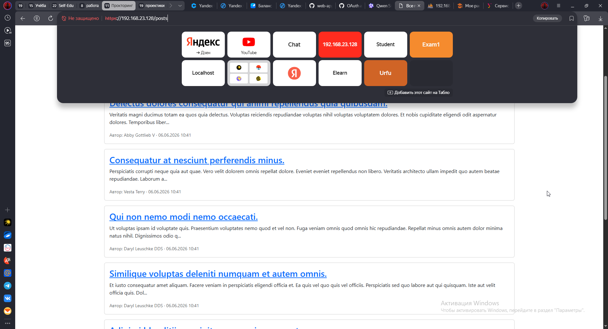

### 12. Страница поста с комментариями

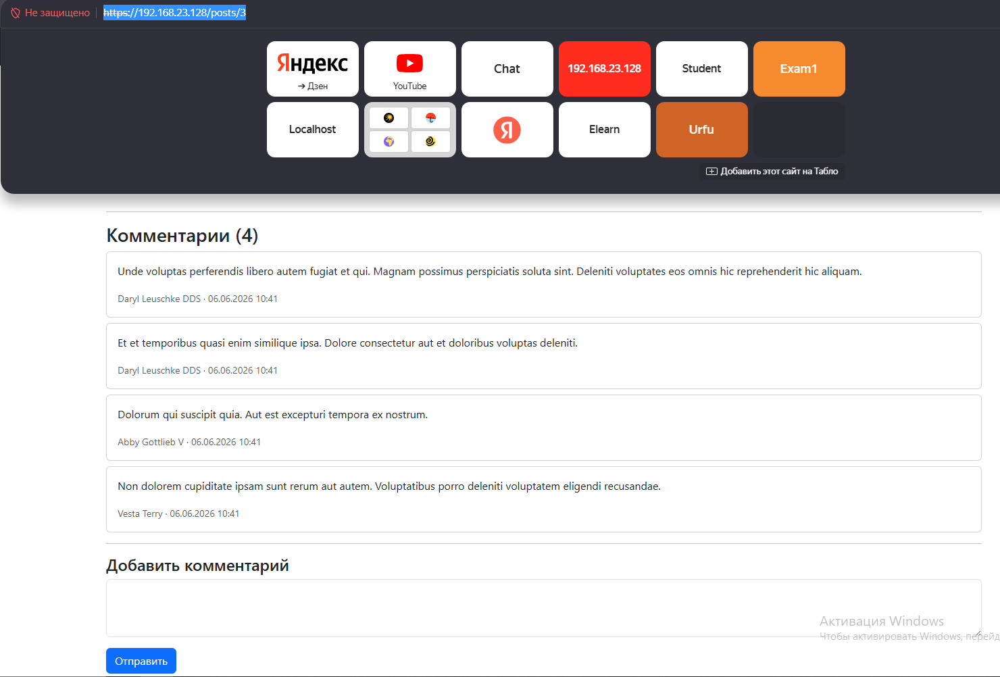

### 13. Создание поста

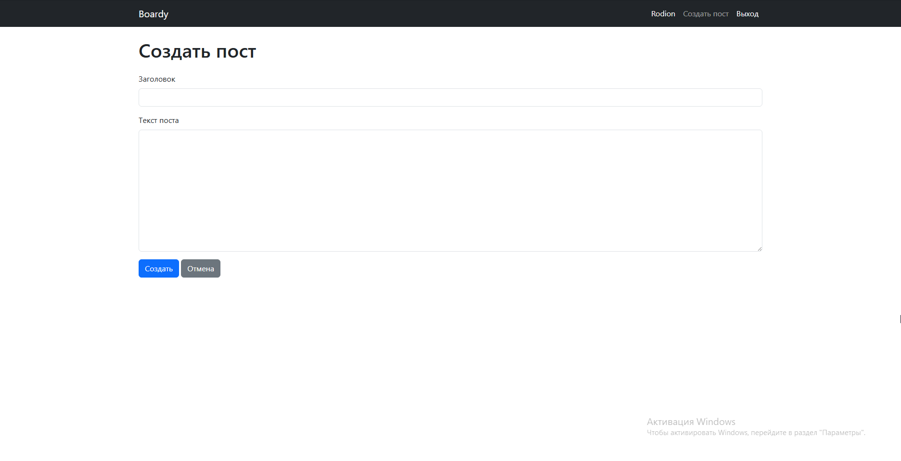
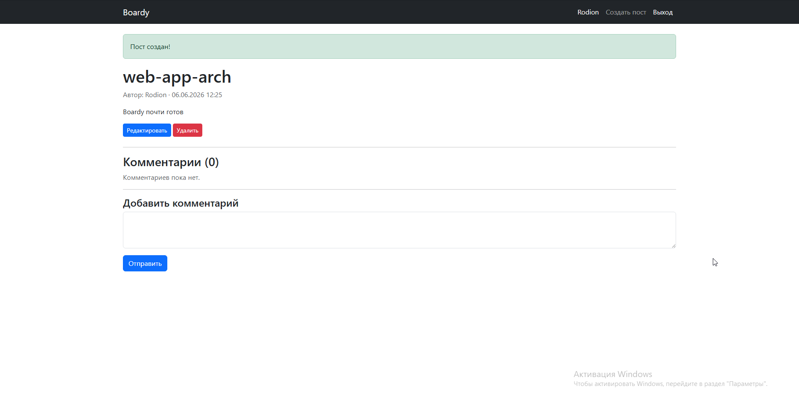

### 14. Policy и редактирование

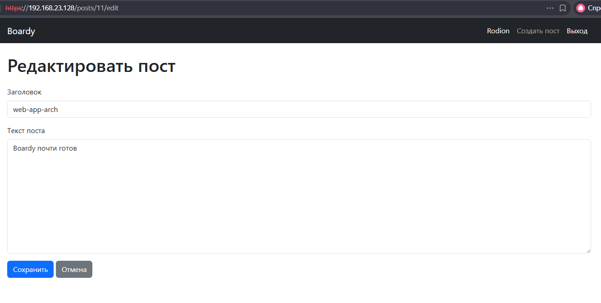
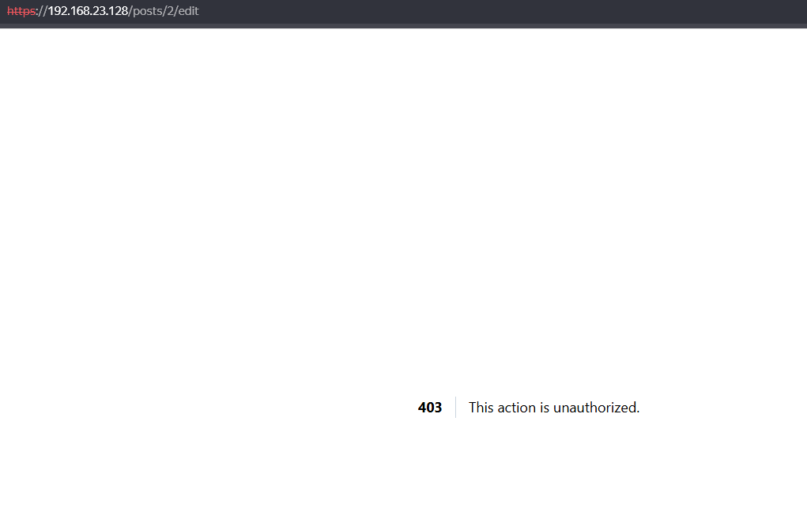

### 15. Удаление поста

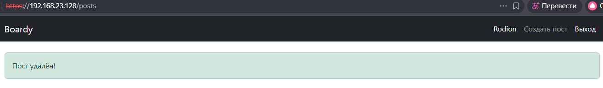

### 16. Комментарий через Blade

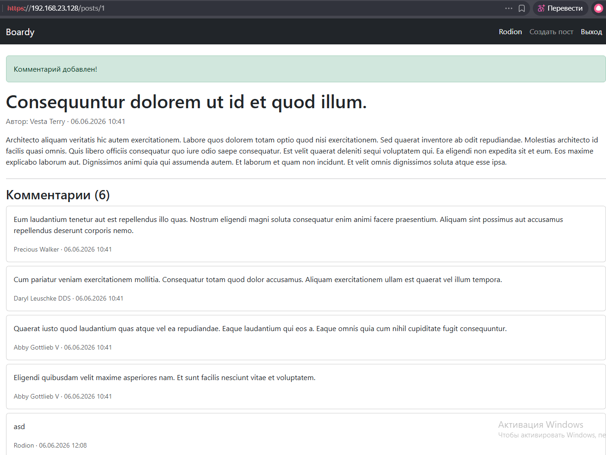

### Часть D. Breeze + Socialite

### 17. Установка Breeze

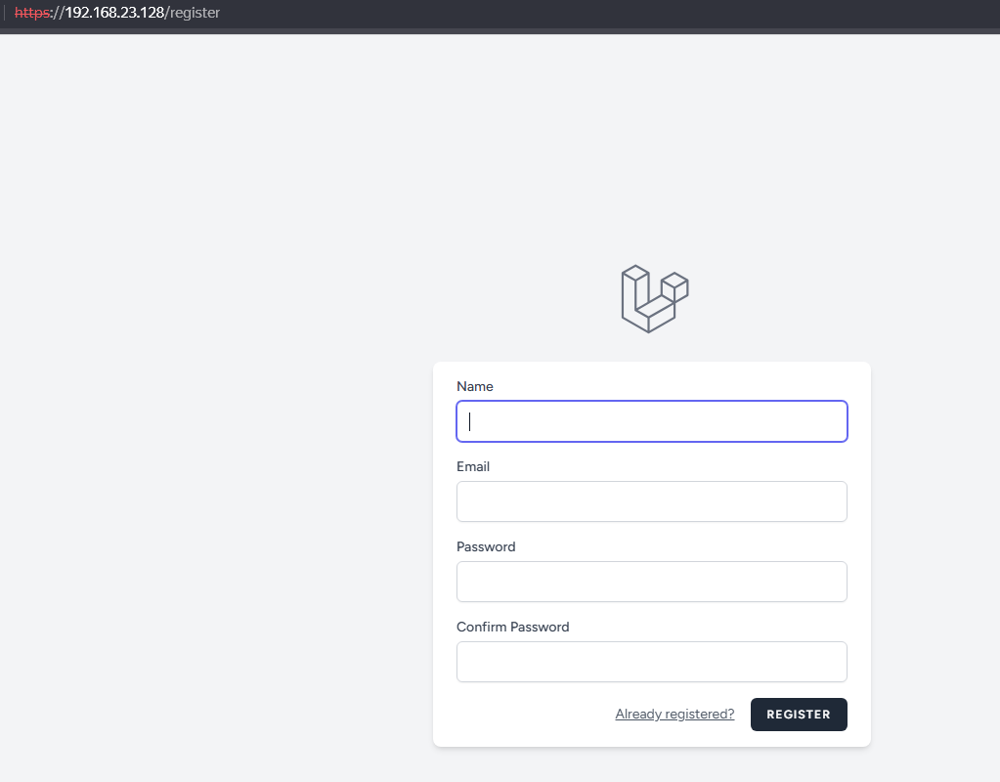


### 18. Регистрация и вход

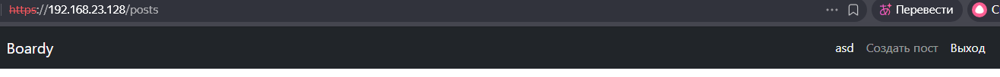

### 19. GitHub OAuth-приложение

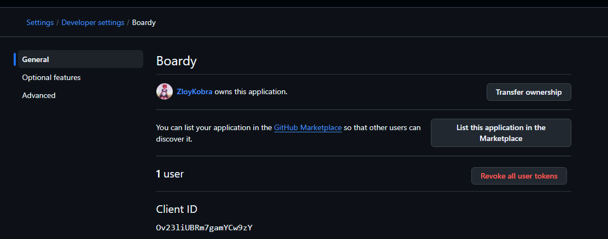

### 20. Socialite

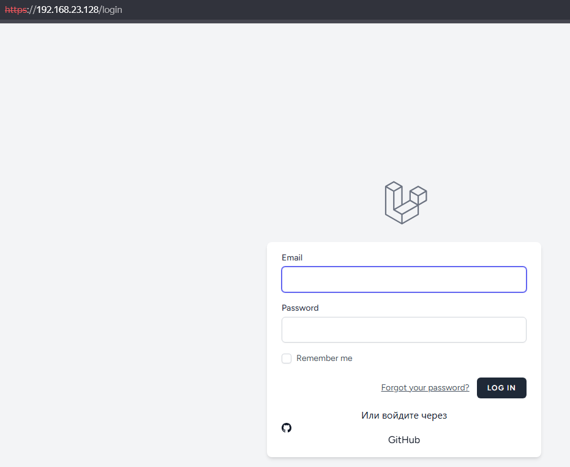

### 21. Полный OAuth flow

Оно было, а после моментальный вход на сайт

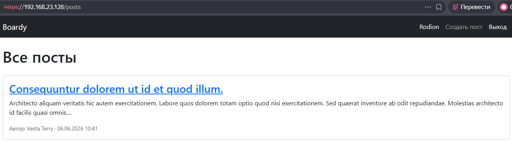
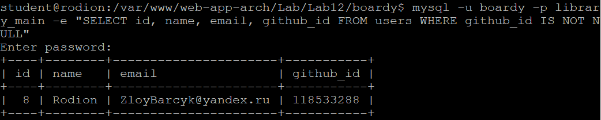

### Часть E. Архитектурные вопросы

### 22. Что осталось от прошлых практик

только БД с Lab8, т.к 9-11 не выполнены... Перескачил потому что с Lab12 идёт "Новый" boardy проект и FastAPI в Lab9-11 выступает как CRUD, а не Laravel

### 23. FastAPI и React

Почему не интегрируем сейчас:
- Laravel ещё не умеет выдавать Bearer-токены — нет OAuth Authorization Server
- FastAPI ожидает JWT-токены, но Laravel их не генерирует
- React-компоненты написаны под старый API с ручной авторизацией

Где пригодятся в Lab13:
- Поставим Laravel Passport — Laravel станет OAuth-сервером, будет выдавать Bearer-токены
- FastAPI перепишем под BFF: валидирует Bearer от Passport (RS256), проксирует запросы в Laravel
- React вернётся на страницу поста — комментарии будут подгружаться через FastAPI с Bearer-токеном

### 24. Реалтайм

Для реалтайма нужен pub/sub-брокер сообщений:

Два кандидата:
- Redis (pub/sub) — in-memory БД, поддерживает каналы publish/subscribe. Laravel publish-ит событие «новый комментарий», подписчики (WebSocket-сервер) получают его мгновенно.
- Pusher / Laravel Reverb — managed WebSocket-сервер. Laravel отправляет событие через HTTP, сервер рассылает его подключённым браузерам через WebSocket.\

Почему именно они:
- Оба интегрируются с Laravel «из коробки» (Laravel Events + Broadcasting)
- Поддерживают каналы (публичные, приватные с авторизацией)
- Масштабируются горизонтально

## ```https://github.com/ZloyKobra/web-app-arch/pull/6```
