# Практика 13
## WebSocket: реалтайм-лента

### Часть A. FastAPI: WebSocket
### 1. ConnectionManager

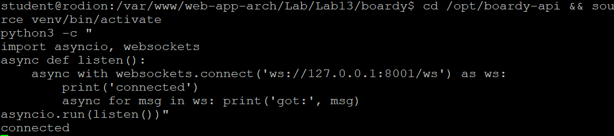

### 2. /internal/broadcast

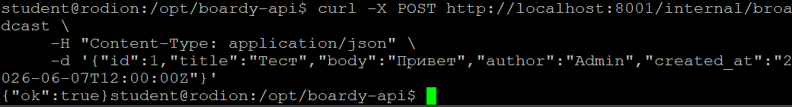

### 3. Два клиента

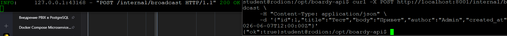

### Часть B. Laravel: HTTP-callback

### 4. PostController

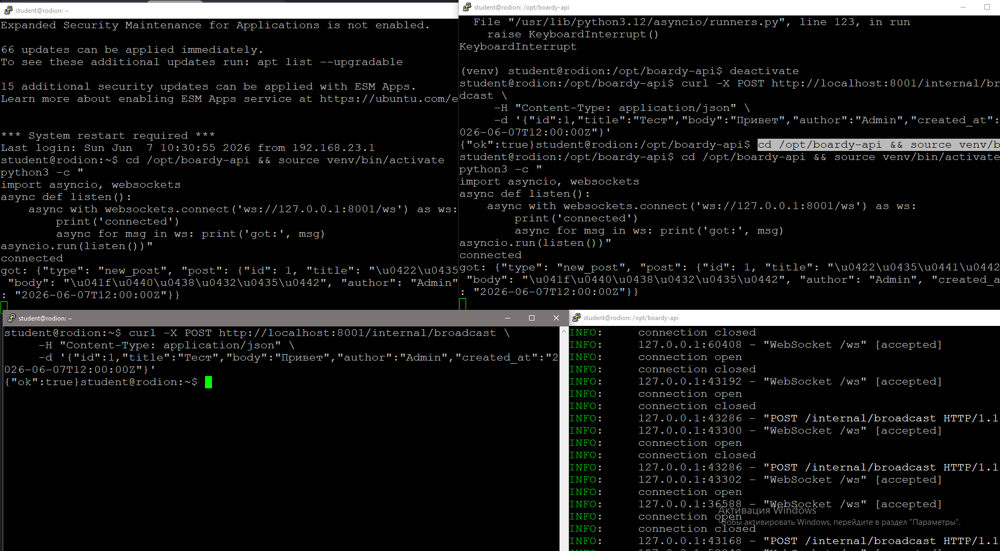

### 5. Проверка callback

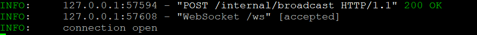

### Часть C. JS клиент

### 6. WebSocket в Blade

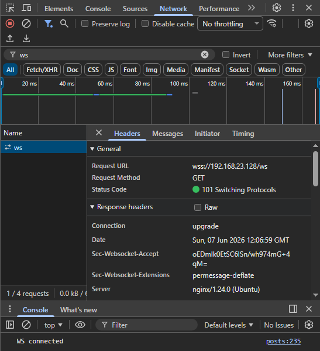

### 7. Два браузера
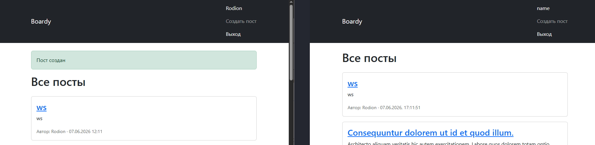
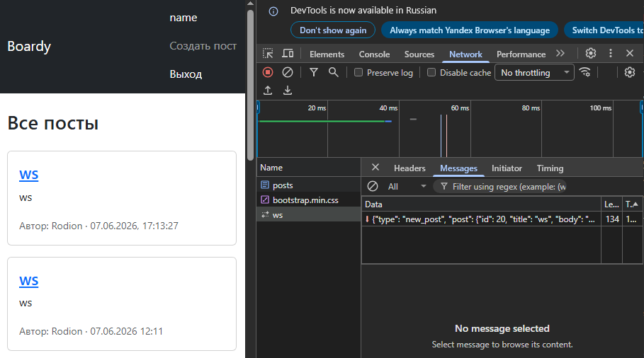

### 8. XSS

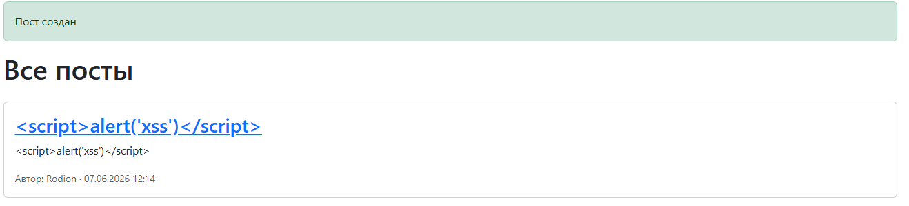

### 9. Переподключение

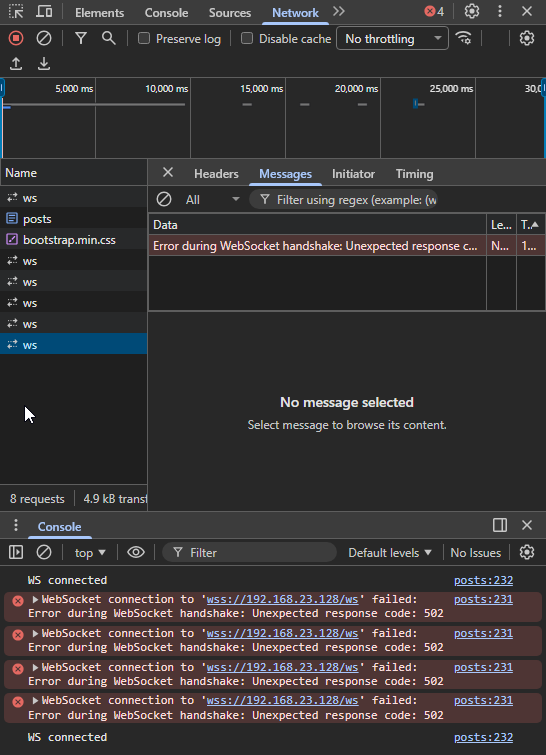

### Часть D. Nginx

### 10. WS-проксирование

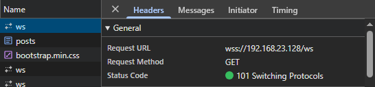

### 11. Закрыть /internal

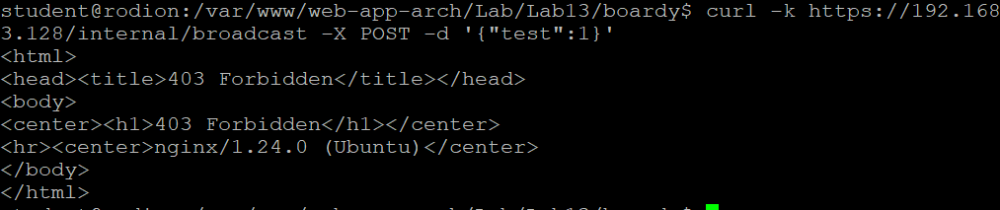


## ```https://github.com/ZloyKobra/web-app-arch/pull/7```
