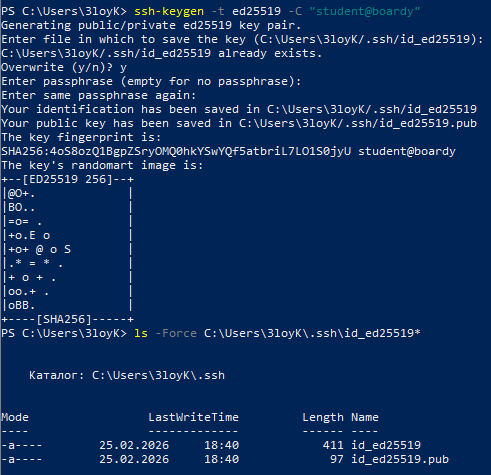
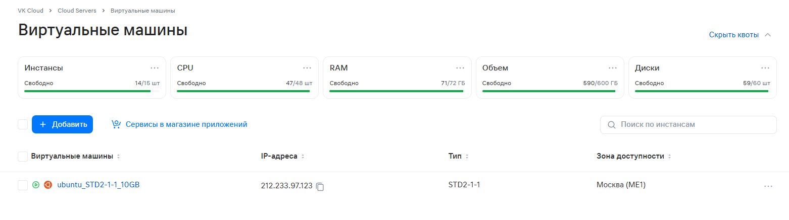
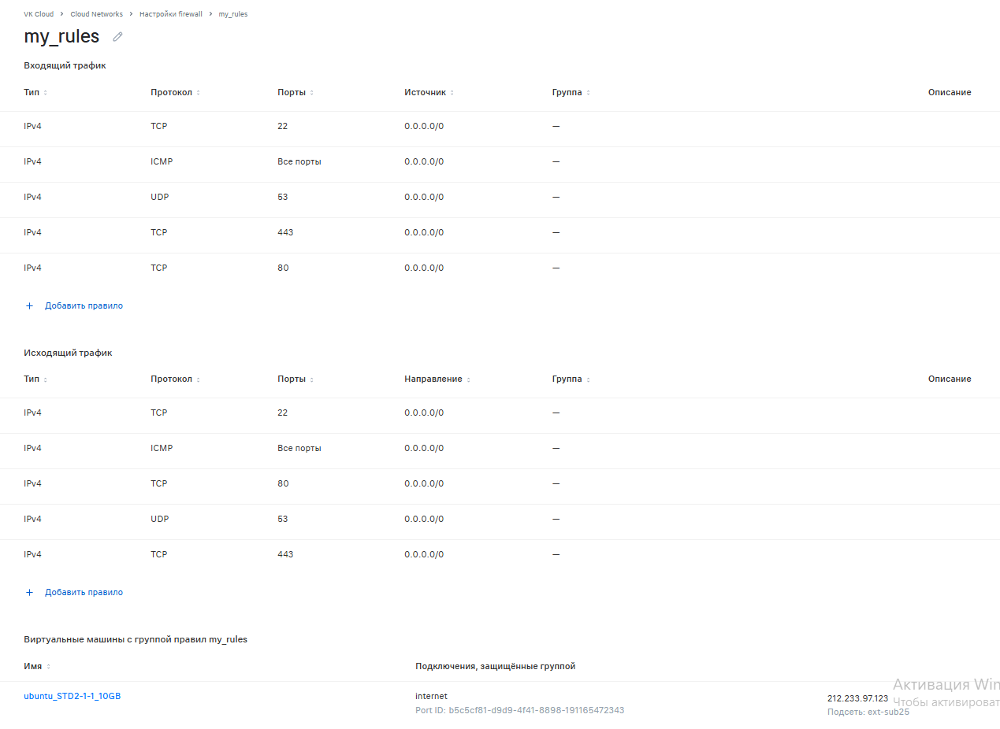
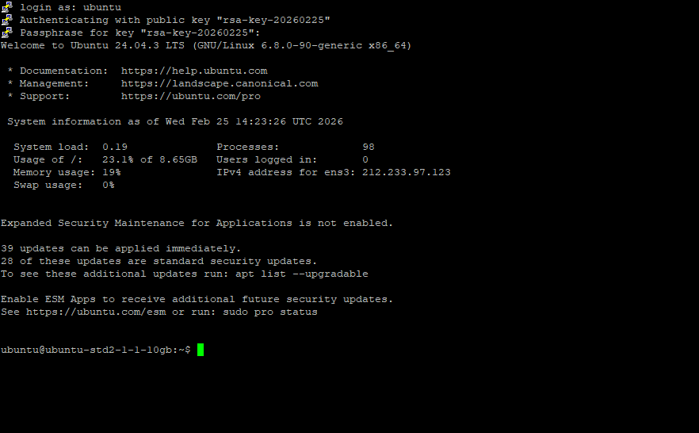
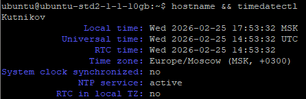
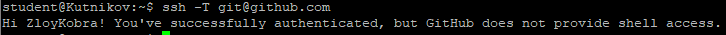
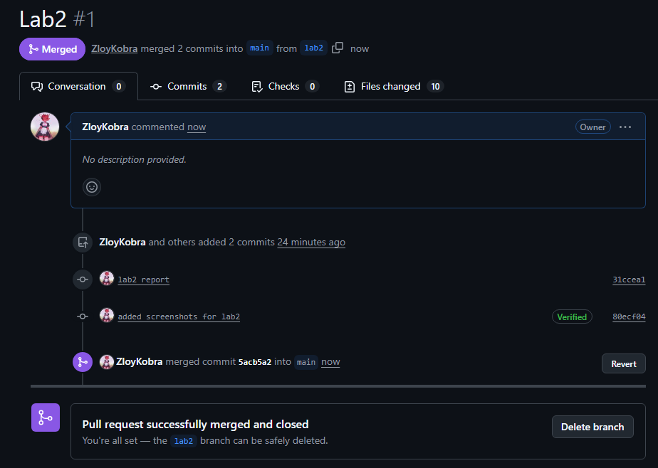

# Практическая работа №2
## VPS, SSH и Git(+Github)

### 1. SSH-ключ

### 2. VPS и файрвол

### 3. Подключение через PuTTY

### 4. Настройка сервера

### 5. Пользователь student

### 6. Git и SSH-ключ → GitHub

### 7. Репозиторий и структура

### 8. Ветка и Pull Request

### Ссылка на PR: 
``https://github.com/ZloyKobra/web-app-arch/pull/1``
