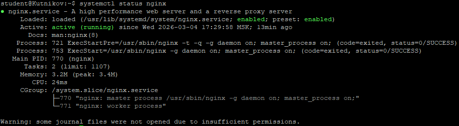
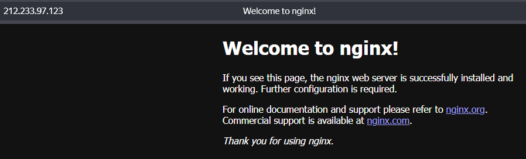
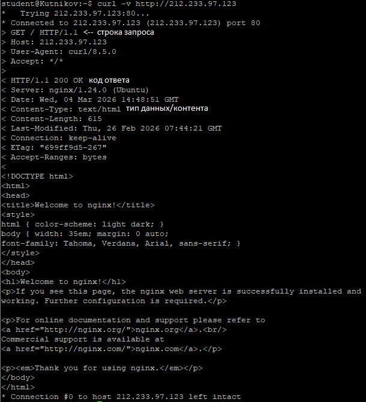
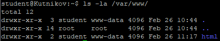
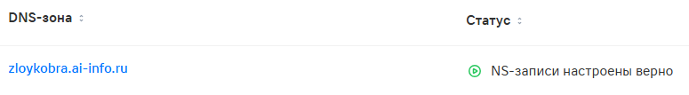
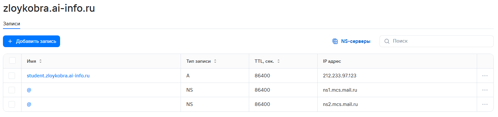
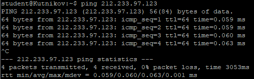
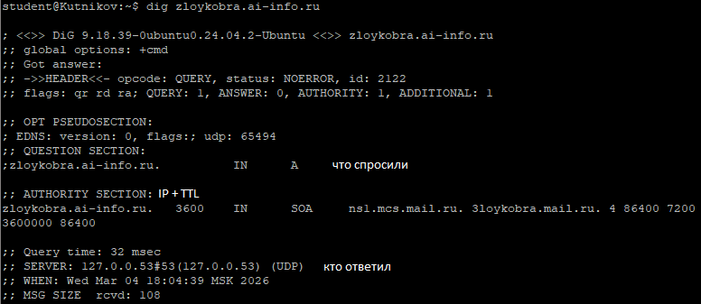
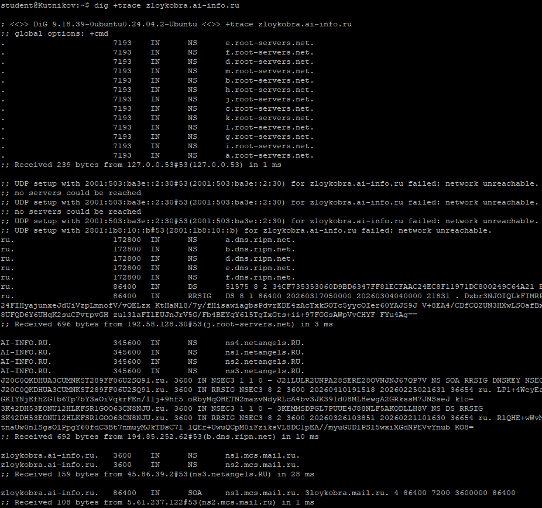
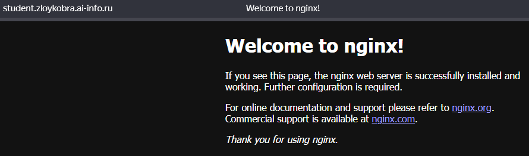

# Практическая работа №3
## Nginx, DNS

### Часть А. Nginx

### 1. Установка Nginx

### 2. Страница по IP

### 3. curl

### 4. Директория и права

Сделал на занятии\

### 5. Конфигурация Nginx

``listen`` - Указывает порт и адрес, на которых Nginx будет слушать и принимать входящие соединения.\
``root`` - Определяет корневую папку на файловой системе, откуда сервер будет отдавать файлы сайта.\
``server_name`` - Задает имя домена или IP-адрес, по которому сервер будет идентифицировать и обрабатывать запросы.\
``index`` - Устанавливает приоритетный список файлов, которые открываются по умолчанию при обращении к директории.

### Часть B. DNS

### 6. DNS-зона

### 7. A-запись

### 8. ping

### 8. dig

### 8. dig +trace

### 8. Сайт по домену

### Ссылка на PR: 
``https://github.com/ZloyKobra/web-app-arch/pull/2``
