# Практическая работа №4
## HTTP, виртуальные хосты, проект Boardy

### Часть А. Виртуальный хост основного сайта

### 1. Директория проекта

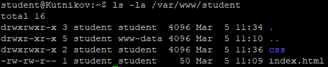

### 2. Конфиг виртуального хоста

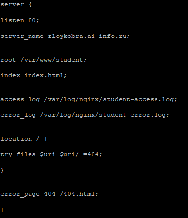

### Часть B. Страницы проекта

### 3. Лендинг
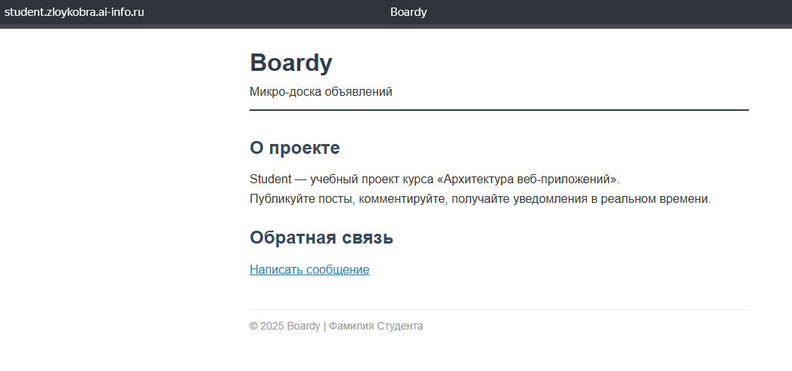

### 4. Форма обратной связи
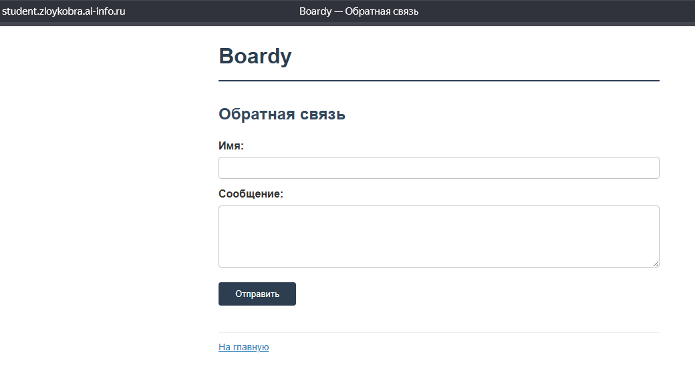

### 5. Стили и 404
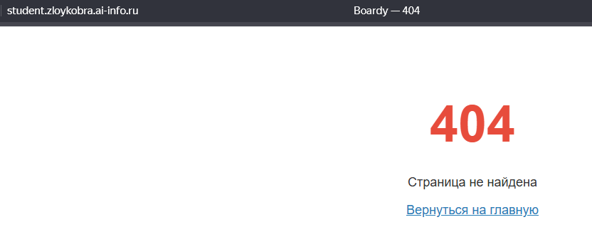

### Часть C. Второй виртуальный хост — API

### 6. DNS-запись для поддомена
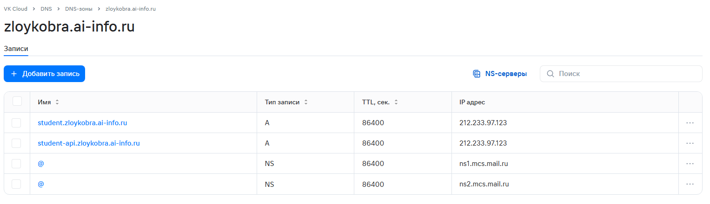

### 7. Проверка DNS
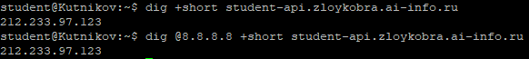

### 8. Конфиг и заглушка API
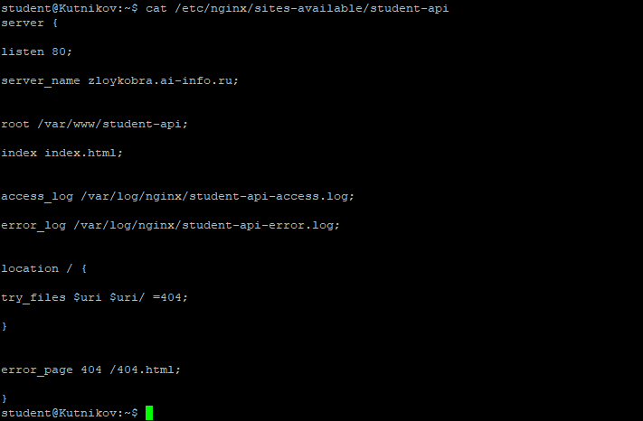
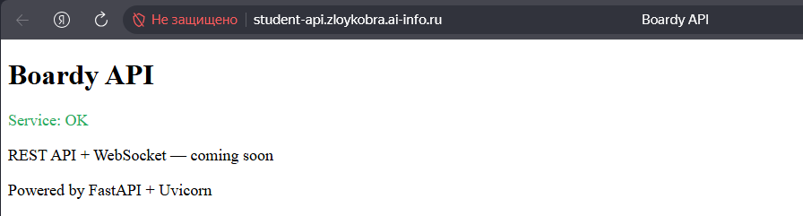

### Часть D. Исследование HTTP

### 9. GET-запрос через curl -v
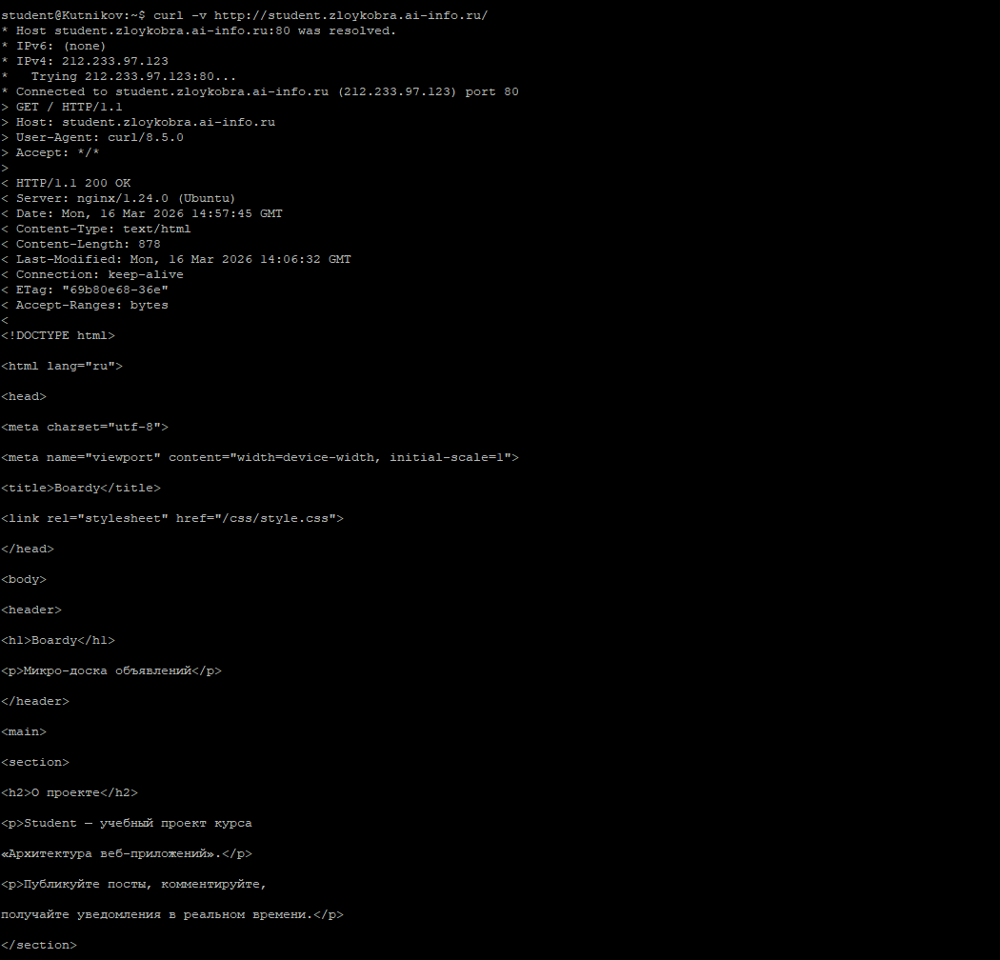

### 10. Виртуальные хосты в действии
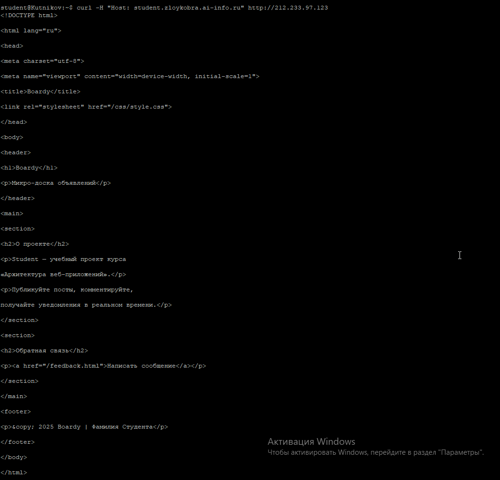
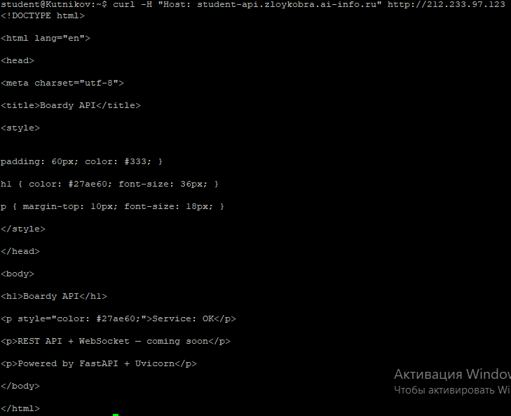
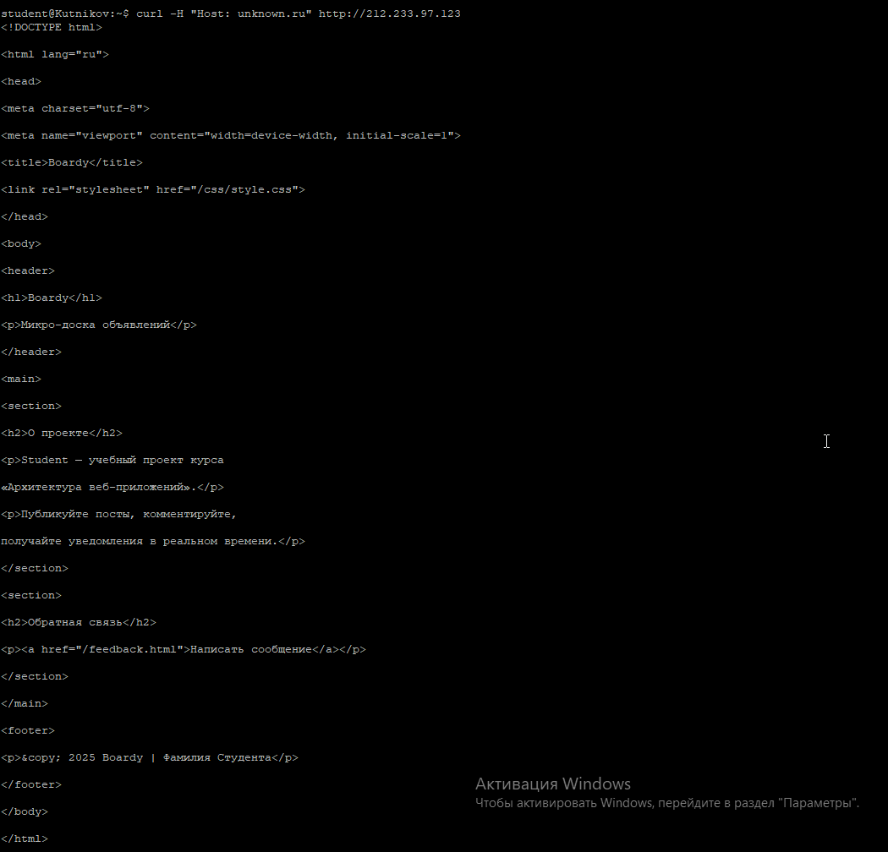

### 11. POST-запрос
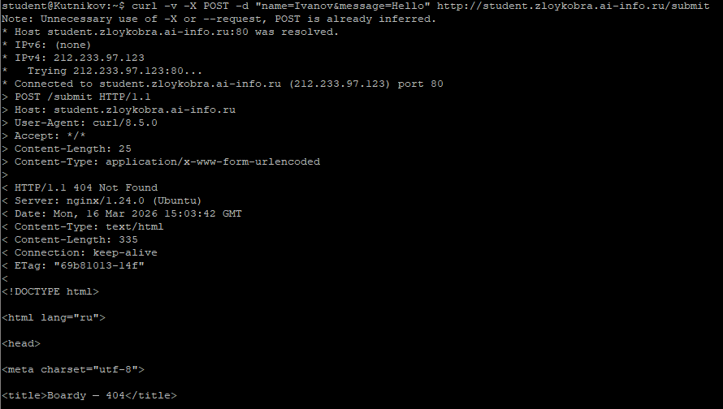

### 12. HEAD-запрос
Head - Возвращает только заголовки в html странице\
Get - Возвращает всю разметку включая текст

### Часть E. Логи

### 13. Раздельные логи
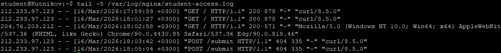
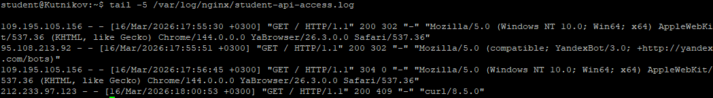

### 14. Фильтрация логов
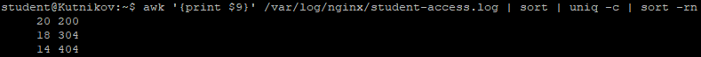

### Ссылка на PR: 
``https://github.com/ZloyKobra/web-app-arch/pull/4``
