## Задание к отчёту
## PHP-FPM и FastAPI для Boardy

### Часть A. PHP-FPM
### 1. Установка PHP-FPM

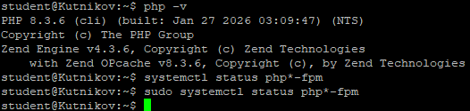

### 2. Форма и сообщения на PHP

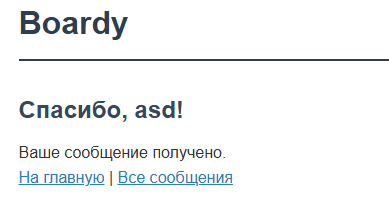

### 3. Конфиг Nginx для PHP

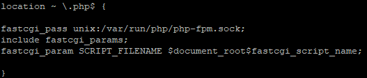

### 4. Shared nothing

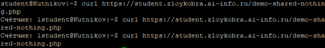

### 5. Блокировка воркеров

### Часть B. FastAPI
### 6. Установка и приложение

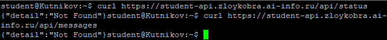
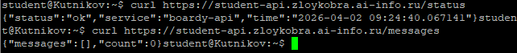

### 7. Живой процесс (счётчик)

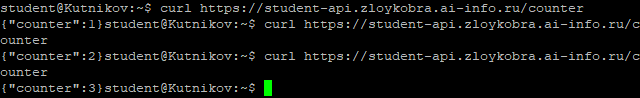

### 8. Async: 10 запросов за 2 секунды

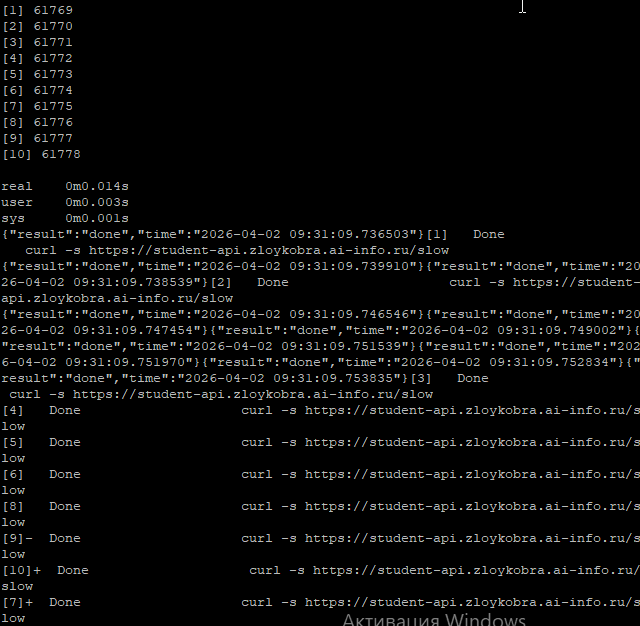

### 9. Блокирующий код убивает event loop

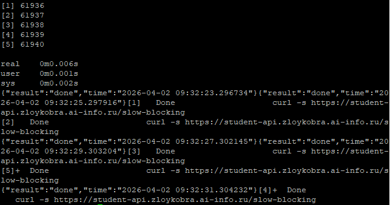

### 10. Swagger

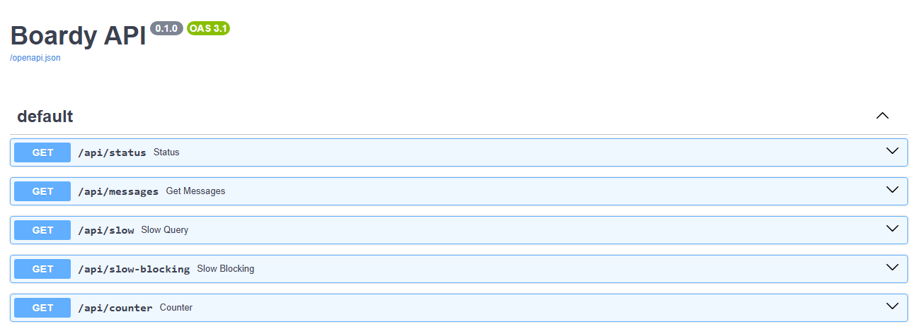

### 11. systemd-сервис

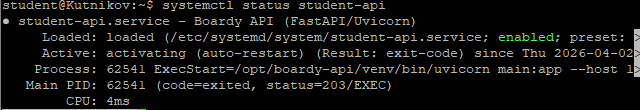

### 12. Nginx proxy_pass

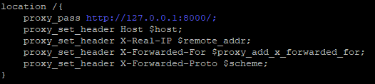

### Часть C. Сравнение

### 13. Два формата

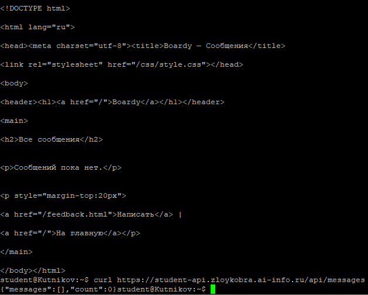

### 14. Процессы

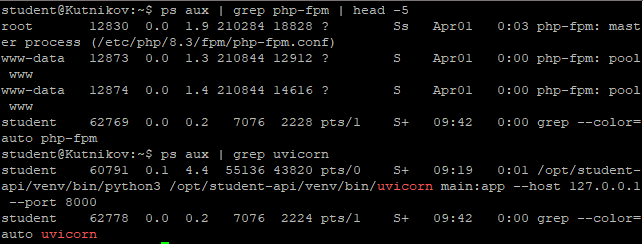
