# Практика 8
## MySQL: от файла к базе данных

### Часть A. MySQL — установка и настройка
### 1. Установка MySQL

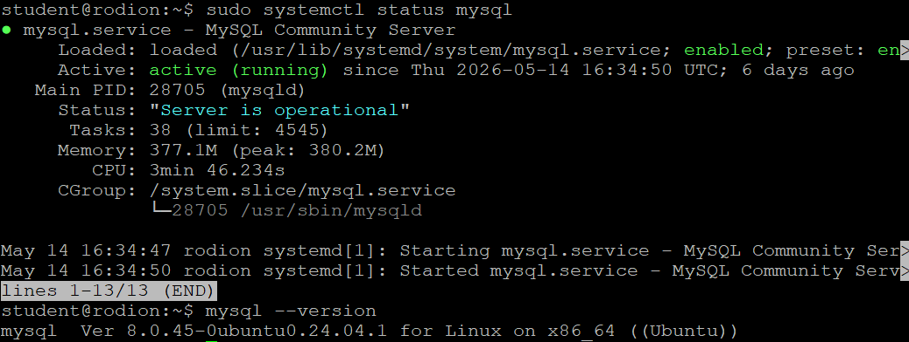

### 2. База данных и пользователь

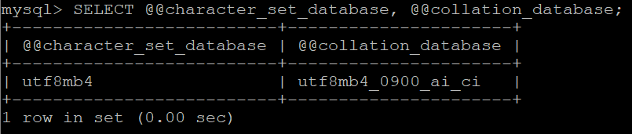

### 3. phpMyAdmin

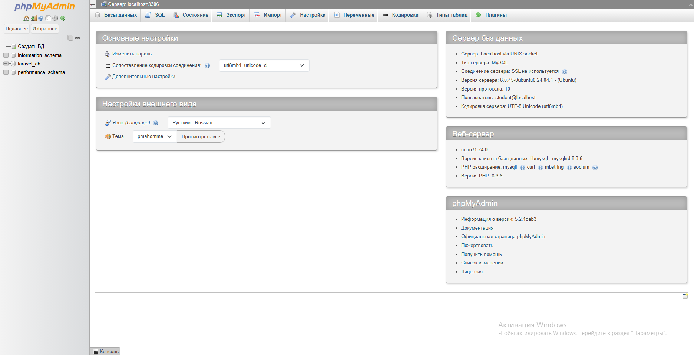

### Часть B. Таблицы и связи
### 4. Три таблицы

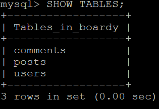
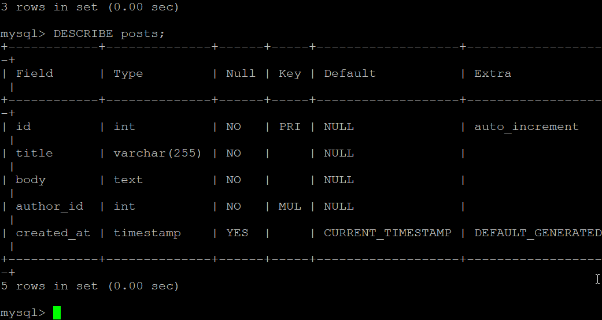
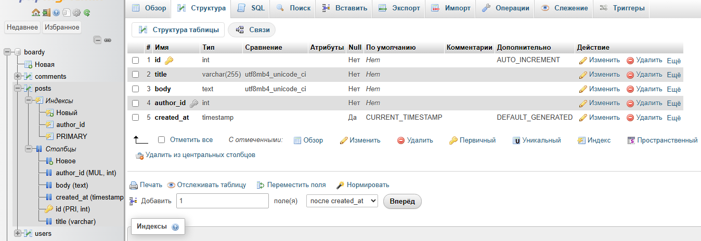

### 5. SQL-скрипт

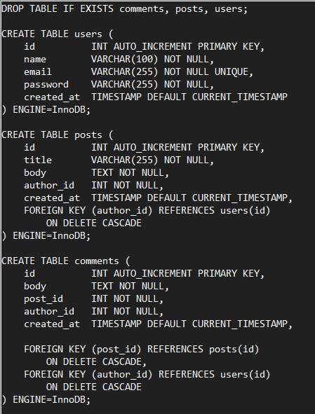

### Часть C. SQL — базовые операции

### 6. INSERT

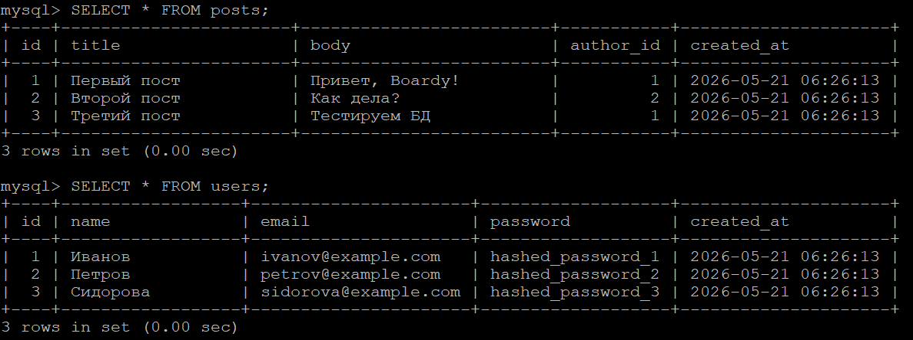
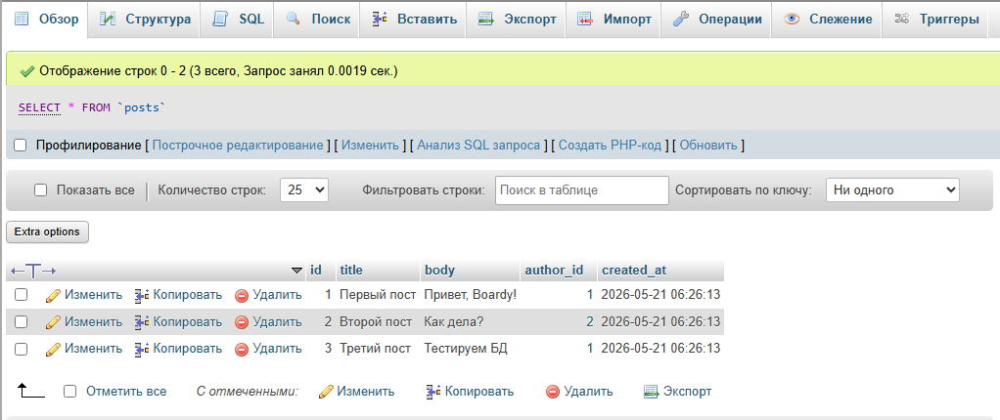


### 7. SELECT + JOIN

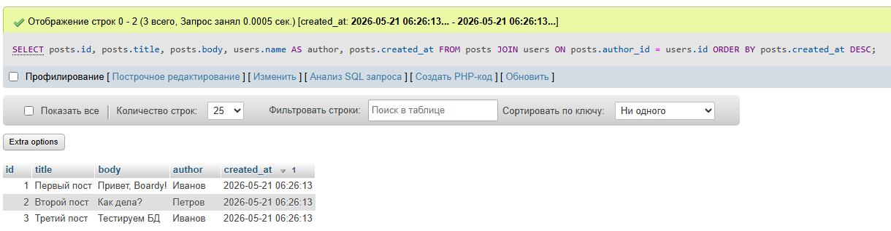
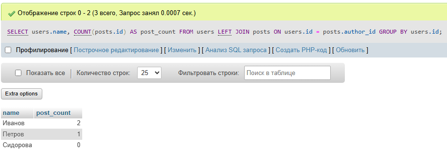

### 8. Foreign Key — защита целостности

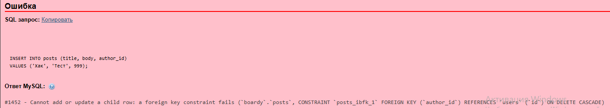

### 9. CASCADE

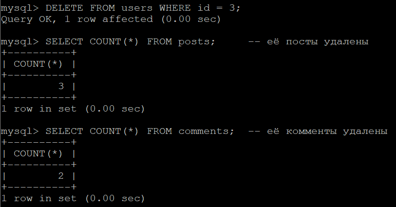

### 10. SQL-инъекция

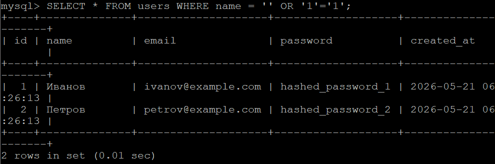

### Часть D. PHP + MySQL
### 11. db.php

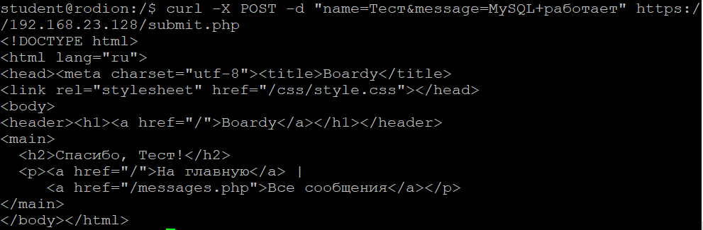
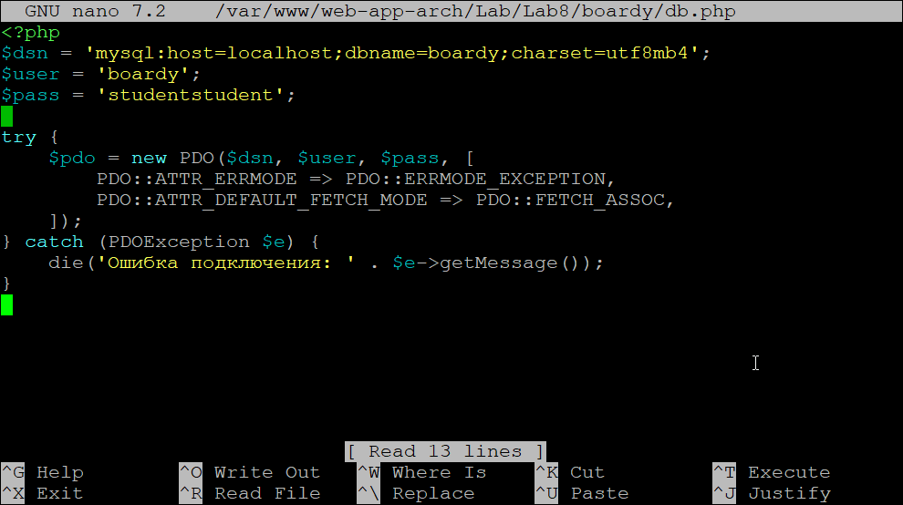

### 12. submit.php через MySQL

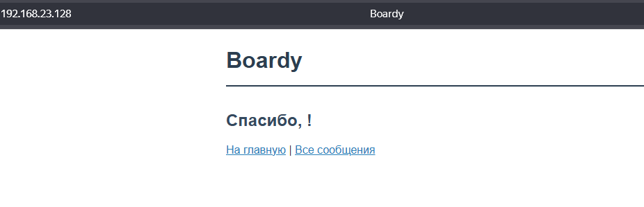
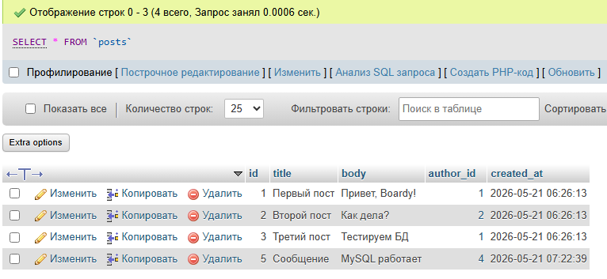

### 13. messages.php через MySQL

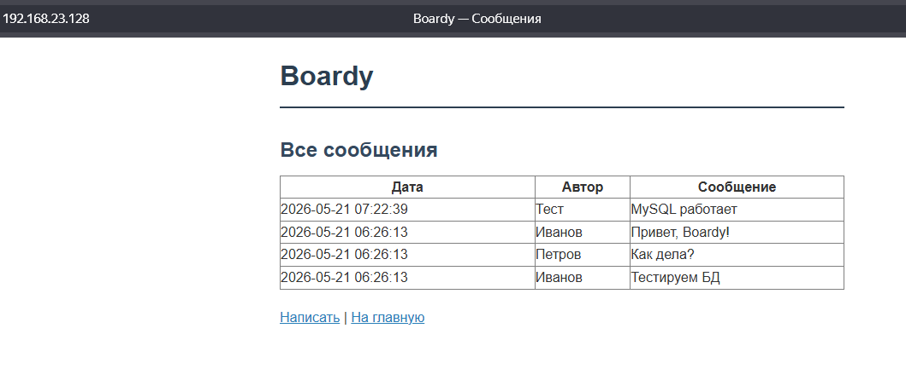

### Часть E. FastAPI + MySQL
### 14. aiomysql

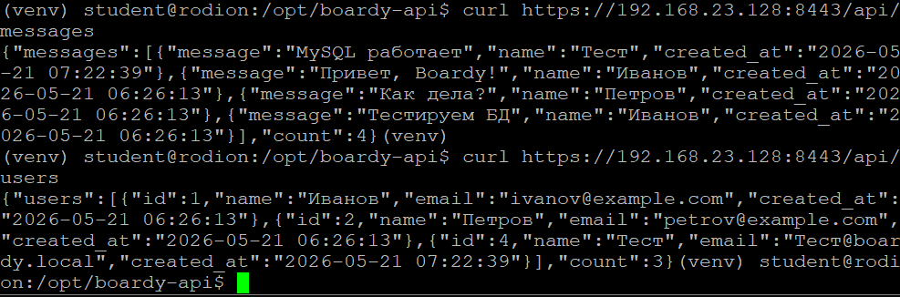

## ```https://github.com/ZloyKobra/web-app-arch/pull/5```
